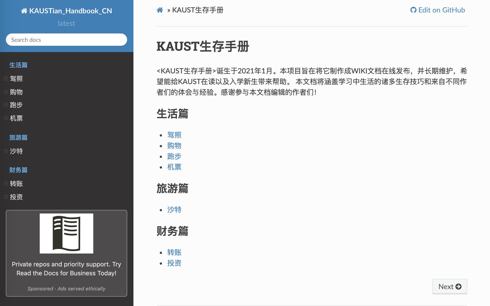

# KAUST生存手册
<KAUST生存手册>诞生于2021年1月。本项目旨在将它制作成WIKI文档在线发布，并长期维护，希望能给KAUST在读以及入学新生带来帮助。 本文档将涵盖学习中生活的诸多生存技巧和来自不同作者们的生活经验。感谢参与本文档编辑的作者们！

网页同步版本网址：[KAUST生存手册](https://kaustian-handbook-cn.readthedocs.io/en/latest/)

## 说明
本文档用reST语言撰写, 并支持Sphinx同步渲染。 

本文档结构如下：

    docs
    ├── index.rst               # 目录文档
    ├── conf.py                 # Sphinx网页渲染所需要的配置文件
    ├── content                 # KAUST生存手册主要内容
        ├── life                # 生活篇
        │     ├── drive.rst     # 驾校，学车
        │
        ├── finance             # 财务篇
        │     ├── tranfer_sar2rmb.rst # 转账回国
        └── ...

    
## 如何贡献本文档
我们欢迎所有的KAUST在读学生、职员以及校友贡献本文档。本文档用reST语言撰写。reST 被认为是简单，实用的标记语言. 这里是reST的[使用文档](https://zh-sphinx-doc.readthedocs.io/en/latest/rest.html). 如果您想贡献文档，可是不了解reST语言，没有关系，上述使用文档可以让你在10分钟以内上手。如果您不想学习reST语言，也没有关系，创建相应的文件（若所需文件不存在），在文件里写入必须的txt文字即可(不需要在乎格式）。  

详细步骤：
1. fork这个仓库(repo)。 
2. 修改你fork的repo。如何修改？例如想添加驾校信息，可以编辑'docs/content/life/drive.rst'；想添加全新的小节，例如在生活篇中加入 '美食'节（假如没有这个小节），可以在'docs/content/life'中新建'food.rst'文件，并添加相应内容，然后在`docs/index.rst`文件相应位置加入新的一行`content/life/food`。可参考'drive.rst'进行编辑。  
3. 在本仓库中请求一个[pull request](https://github.com/guochengqian/KAUSTian_Handbook_CN/pulls). 
4. 审核通过后，您的内容将出现在本文档中。

如果需要加入图片，请参考docs/content/travel/saudi.rst。并且把图片上传到docs/_static/image这个文件夹

以上就是全部啦，谢谢大家的贡献！！

