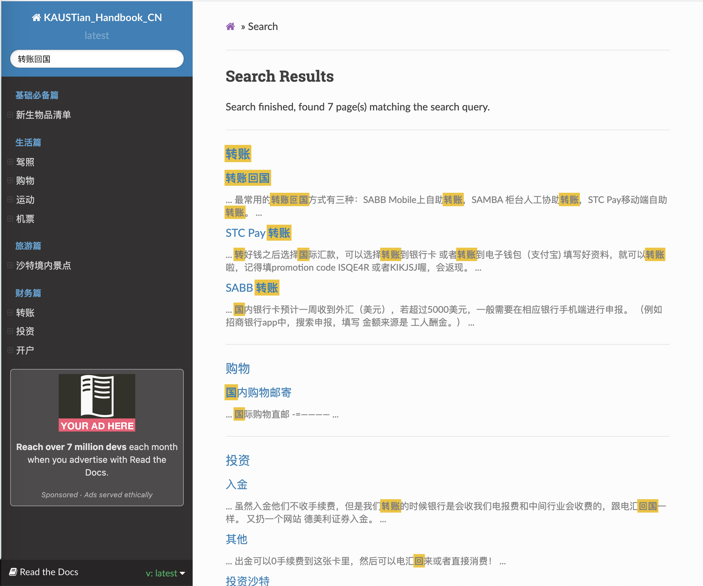

# KAUST生存手册
[《KAUST生存手册》](https://kaustian-handbook-cn.readthedocs.io/en/latest/)诞生于2021年1月26日。本手册旨在集中与分享KAUST生活、学习及娱乐中的诸多感悟、经验和技巧。《KAUST生存手册》支持网页在线预览。 我们希望手册可以在我们和社区的共同维护下一直存活下去，并能给KAUST入学新生、在读学生、职员、家属以及校友带来帮助。 感谢参与本手册编辑的作者们！

网页同步版本网址：[《KAUST生存手册》](https://kaustian-handbook-cn.readthedocs.io/en/latest/)。下图截取时间：2021年1月27日。本网站将在社区的协助下持续更新。 

## 使用方法
《KAUST生存手册》支持随时随地网页访问，[《KAUST生存手册》网址](https://kaustian-handbook-cn.readthedocs.io/en/latest/)。用户可以在《KAUST生存手册》很方便地进行内容的检索。 

## 说明
本手册用reST语言撰写, 并支持Sphinx同步渲染。 

本手册结构如下：

    docs
    ├── index.rst               # 目录手册
    ├── conf.py                 # Sphinx网页渲染所需要的配置文件
    ├── content                 # KAUST生存手册主要内容
        ├── life                # 生活篇
        │     ├── drive.rst     # 驾校，学车
        │     ├── shopping.rst  # 购物
        │
        ├── finance             # 财务篇
        │     ├── tranfer.rst   # 转账回国
        └── ...

    
## 如何贡献本手册
我们欢迎所有的KAUST在读学生、职员、家属以及校友贡献本手册。本手册用reST语言撰写。reST 被认为是简单，实用的标记语言. 这里是reST的[使用文档](https://zh-sphinx-doc.readthedocs.io/en/latest/rest.html). 如果您想贡献本手册，可是不了解reST语言，没有关系，上述使用文档可以让你在10分钟以内上手。如果您不想学习reST语言，也没有关系，创建相应的文件（若所需文件不存在），在文件里写入必须的txt文字即可(不需要在乎格式）。  

详细步骤：

1. fork这个仓库(repo)。 如果已经fork，在你改动你的仓库之前，记得更新你的仓库。更新方法： 1）在你的仓库请求一个pull request； 2）选择compare across fork； 3） pull request的左侧选中你的仓库，右侧选中[本仓库](https://github.com/guochengqian/KAUSTian_Handbook_CN），这样左侧（你的仓库）的内容会被右侧（本仓库）内容更新。 如下图所示。

2. 修改你fork的repo。如何修改？例如想添加驾校信息，可以编辑'docs/content/life/drive.rst'；想添加全新的小节，例如在生活篇中加入 '美食'节（假如没有这个小节），可以在'docs/content/life'中新建'food.rst'文件，并添加相应内容，然后在`docs/index.rst`文件相应位置加入新的一行`content/life/food`。可参考'drive.rst'进行编辑。  

3. 在本仓库中请求一个[pull request](https://github.com/guochengqian/KAUSTian_Handbook_CN/pulls). 点击new pull request, 点击compare across fork, pull request的左侧选中本仓库，右侧选中你的仓库。 确认后提交request. 

4. 审核通过后，您的内容将出现在本手册中。

NOTE: 如果需要加入图片，请参考docs/content/travel/saudi.rst。并且把图片上传到docs/_static/image这个文件夹

## 我不想学Github的使用，我只是想贡献一份力量
如果您不想使用pull request功能，您依然有两种方法贡献《KAUST生存手册》。

1. issue -> new issue -> 在issue内写下 相关文字即可。 会有管理人员将您的文字整理到手册里； 

2. 微信或电邮联系任何一个管理员，并写下 相关文字，我们会整理到手册中。 

## 联系方式
[Guocheng Qian 钱国成](mailto:guocheng.qian@kaust.edu.sa)  

以上就是全部啦，谢谢大家的贡献！！

