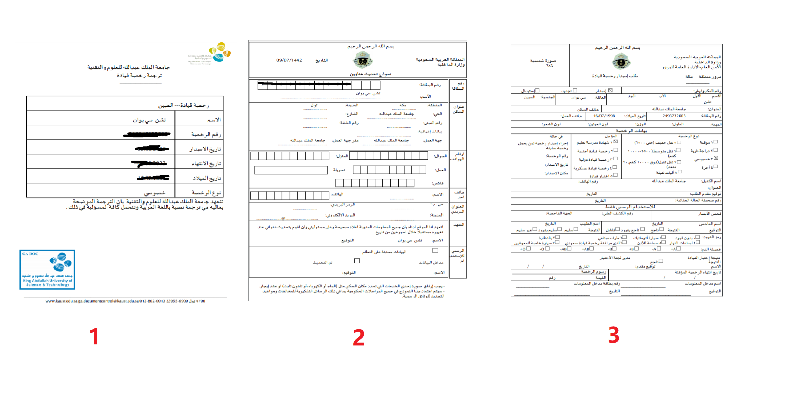
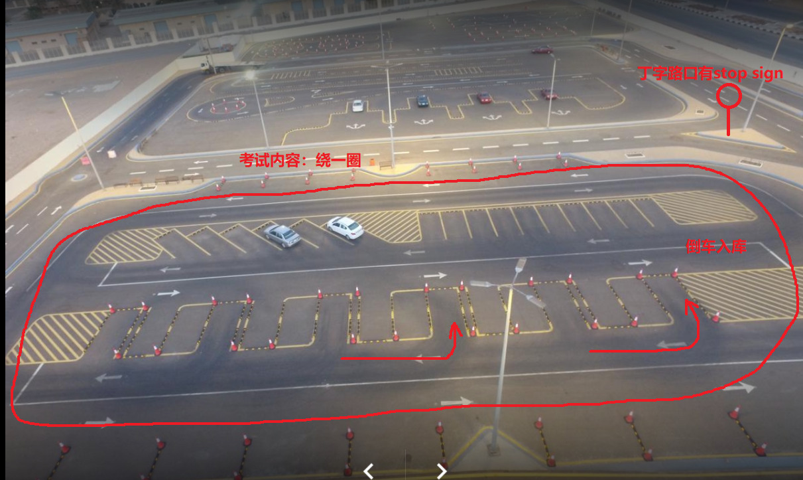

:github_url: https://github.com/guochengqian/KAUSTian_Handbook_CN

驾照
========

驾校选择
------

选项：
  
1. 拉比格
2. 吉达

一：新人学车
------

步骤：  

1. Book an appointment through `KAUST self service <https://ga.kaust.edu.sa/ga/service-details/government-affair/motor-vehicle-services/vehicle-driving-license-issue>`_。 打印两张表格（是阿拉伯语）。 
2. 注册第一次路考（在学车之前也是需要先路考一次，来决定学习的时常， 通常是5天）。 注册方法： `登录MOI网站 <https://www.moi.gov.sa/wps/portal>`_： 点击左侧Electronic Services -> Appointments -> more -> Traffic 进行路考预定。 可以打印注册成功的文件（不过不需要）。
3. 准备4张照片， KAUST Building 4对面可以免费照相，可以选择美国护照格式 （该机器需要拍三次， 手动选择三次中最好的一次 自动洗照片。）
4. 准备相关证件材料（Iqama, 4张照片， 2个打印表格）。
5. 约车， 前往驾校 （早上8点到，如果选择的是拉比格驾校的话，建议提前一小时从KAUST出发）。 可约 KAUST 工作人员的车 （价格会比KAUST TAXI 优惠一点，3到4人同行约每人60沙往返）。
6. 到驾校后，第一天，注册学车和进行路考，按照流程来就行（前台会告诉你怎么做）。注册驾校学车时候，1） 缴费500沙； 2）选择手动挡还是自动挡； 3） 选择学车时间：早上， 下午，还是晚上学车。
7. 一般从周日开始学车，连续5天上课Practice， 新手需要额外在周六进行理论课教学，下周考试（一般是周日，周一或者周二）。 建议不管是哪个驾校，拿到训练单子后，左下角有个日期，看看是不是说好的日期，然后每天练车单子给他们后，他们应该要签到打勾☑️，满5天（老手5天，新手6天）后会盖章然后告诉你什么时候考试。
8. 考试当天要7点左右到，7点半开始路考，路过通过后，直接进行理论考试。 路考技巧： 1） 尽量在前面考； 2）直道车速不能慢，20码左右； 3）停车，倒车 一气呵成，不要停顿； 4） 打方向灯； 5） 转弯不要压到黄线； 6） STOP完全停住（车速为0）。 理论考试（英文）很简单，一共25道题，选择20道作答，对15道即可，看到不会的选择delay questions。 不需要额外准备（作者只在理论课上看了1小时，课下看了30分钟）。  理论课没过，只需要重新考理论即可。
9. 考试通过后，去交钱。 不要在驾校对面交，会多收100沙。 建议在 任意一个沙特银行卡网上银行支付。 以SABB为例， 登录SABB APP -> Bills&Payment -> MOI Service -> Drive license -> Issue new license -> ID输入 iqama -> Type选择 Private -> 驾照时间选择 10年 （沙特是国际驾照，使用沙特驾照可在欧洲，东南亚，美国等多个国家自驾游）。国内的驾照不属于国际驾照，沙特驾照不能直接在国内用，不过可以用来换驾照。
10. 不能现场取驾照，下午一点取。可以让学校GA帮忙取。把盖好章的学车单带到GA，告诉前台，前台会复印你的iqama，收下你的单子帮你取。 或者让司机帮你取。

二：国内驾照换沙特驾照(Male 男性)(Driving School in Rabigh 拉比格驾校)
---------

**更新时间 2021年2月23日**

1.1 材料准备
^^^^^^^^^^^^^^^^
首先到 `VEHICLE DRIVING LICENSE ISSUE (MALE) <https://governmentaffairs.kaust.edu.sa/ga/service-details/government-affair/motor-vehicle-services/vehicle-driving-license-issue>`_
Motor vehicle service ->Driving license issue -> 填写所有信息， 注意License Number 填身份证号！

然后你会获得三张表格，全部彩色印刷，带Government Affair 蓝色鲜章的那个表请仔细核对，如果和驾照原件的时间和身份证号不符会被退回：

需要如下材料：

* Original Iqama

* Original driving license (if applicable)

* 100 SAR for Medical checkup

* 4 Personal Photos (white background)

* Supporting applications (printed in color)(3张表格彩印)

* Pay driving license fee through online banking (SADAD)

按照上面链接准备好如下材料后，最好再准备驾照原件+Iqama的彩色复印件若干，驾校虽然会给复印但是5sar/张

同时，需要在手机银行预先缴纳驾照费用，Type选择 Private -> 驾照时间选择 10年，费用400。

To Pay from Your bank account:

1. Log on to your online banking

2. Click SADAD, then click government services

3. Chose “driving license”, type you Iqama number. From the menu

4. Select the type of required license (private)

5. Select the duration

6. Finally approve the payment

1.2 预约考试
^^^^^^^^^^^^^^^^
官方链接  `VEHICLE DRIVING LICENSE ISSUE (MALE) <https://governmentaffairs.kaust.edu.sa/ga/service-details/government-affair/motor-vehicle-services/vehicle-driving-license-issue>`_  需要在absher上预约，但是absher上预约的位置是Driver Licence Station in Rabigh，而不是Driving School in Rabigh。吉达驾校可以absher预约。

拉比格的驾校预约方式如下：

访问网址: https://sd-driveschool.com 这个网址校园网无法访问，不知道为什么。。请使用4G访问并预约时间。

拉比格驾校电话 +966 567007707 可以打电话询问

如果不放心也可通过Whatsapp 和他联系 号码同样是 +966 567007707

也可谷歌搜索 Driving School in Rabigh 获取地址以及电话信息。

1.3 考试当天
^^^^^^^^^^^^^^^^
手机下载 KAUST ride APP 最好提前一天预约出租车。拉比格没有uber类似软件，所以上车前需要和KAUST的司机说好在考场外面等，等候需要加钱，亲测：一趟来回350sar左右（包含1小时等待）。

自动挡和手动挡发的证是一样的，所以考试就选择自动挡。考试内容真的是看考官心情：我前面一个白人（也是KAUST来的），转了一圈就结束了，我还考了倒车入库。。。

考试内容基本如下：

a. 车子一般启动好了，所以无需启动

b. 绕着场地开一圈，注意到STOP sign的地方停下，考官不会提示

c. 直角倒车入库，需要一次完成，具体点位参考 `B站视频<https://www.bilibili.com/video/BV1Zt411j7bD?from=search&seid=15457051028785562790>`_

驾校俯瞰图：

1.4 注意事项
^^^^^^^^^^^^^^^^
a. 可以根据上述俯瞰图自行联系3个平行车位的倒车入库点位，倒车入库是主要挂科的重点，需要引起重视，考试前如果有机会练习请多加练习。

b. 每个倒车入库的库边有突起障碍物，如果压线，轮子会被抵住，考官会有感觉

c. 我遇到的考官故意刁难我，让我在没有足够空间入库的位置倒车，如果遇到上述情况：你需要明确表示这无法成功，会碰到库边。我的教官于是又给了我一次机会，第二次完美入库。

d. 同时也会有练车和考试同时在场的情况，需要临场应变

最后：
^^^^^^^^^^^^^^^^
拉比格驾校最大的优点是：人不多。基本今天能够约第二天的考试。

但是缺点也很明显，考官比较严格，传闻年底有指标会挂大部分考生。

Anyway，希望以上信息对你有所帮助，祝考试顺利！

三：国内驾照换沙特驾照(Male 男性)(Driving School in Jeddah 吉达驾校)
---------

四：沙特驾照换国内驾照
---------

链接： https://zhuanlan.zhihu.com/p/67267383

