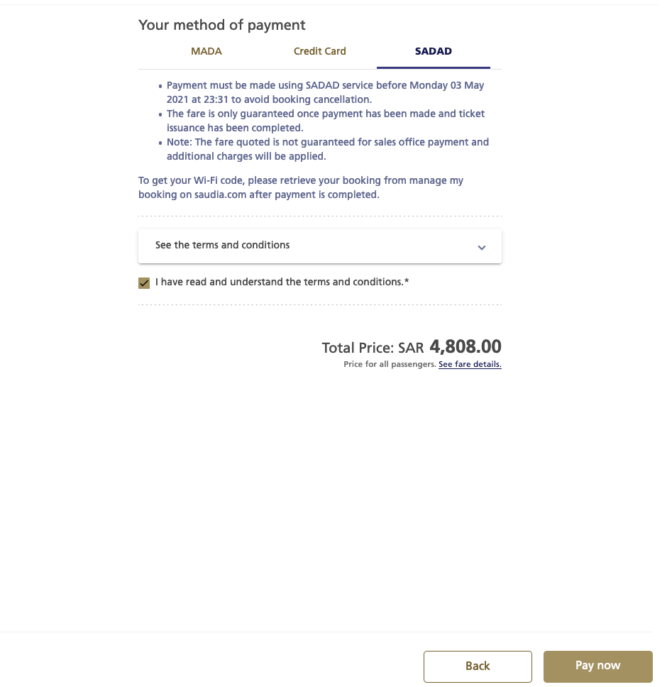

:github_url: https://github.com/guochengqian/KAUSTian_Handbook_CN

机票
======

沙特航空
-------

登录沙特航空官网
https://book.saudia.com/sv-apix/dyn/core/booking/search
选择日期和起降点，继续选择喜欢的航班，然后填写乘机人信息,确认无误后就是付款页面,选择SADAD，如下图所示

选择pay now之后窗口和邮件都会收到关于类似于这样的付款的信息，``Please proceed with payment by Monday 03 May 2021 23:31. Payments can be performed using one of the following options:
Through SADAD using the reference number: 252007173021 (SADAD Biller Code: 022)
By visiting any Saudia Airlines sales offices``

收到信息之后就可以登录银行APP付款了，选择bill and payments, 输入biller code 022，确认是沙特航空，之后再输入reference number,就可以付款了。

付款之前再三确认乘机人信息和航班是否无误，一般会给你三天时间付款，所以不用急着付款。

